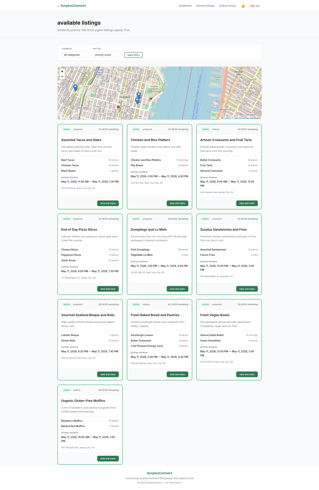
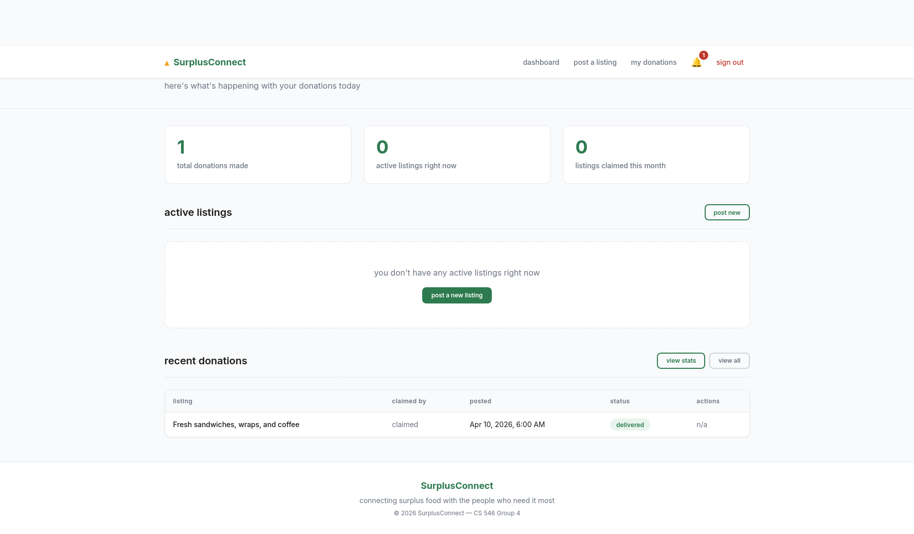
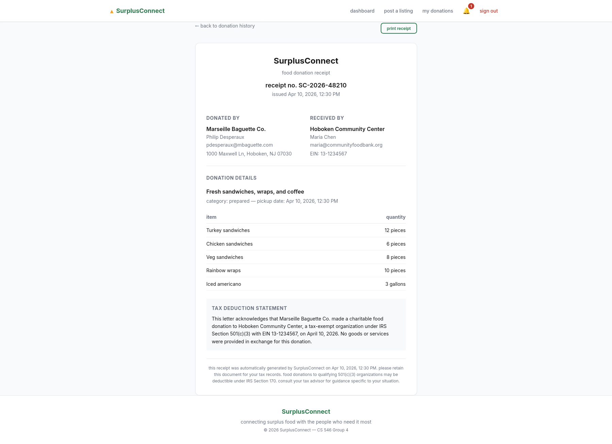

# SurplusConnect

> Connecting NYC food businesses with nonprofits to rescue surplus food before it goes to waste.


---

## Overview

SurplusConnect is a web platform that bridges the gap between food businesses with surplus inventory and verified nonprofit organizations that distribute food to communities in need. Restaurants, bakeries, and food vendors post available donations with real-time countdown timers and priority scores. Verified 501(c)(3) distributors browse, claim, and coordinate pickups through an integrated chat system. Every completed donation generates a printable IRS-compliant tax receipt for the donor.

The platform enforces a secure four-role system covering donors, distributors, volunteers, and administrators, with session-based authentication, bcrypt password hashing, and EIN verification against the IRS nonprofit database via the ProPublica Nonprofit Explorer API.

---

## Screenshots

### Browse Listings
Active food donations sorted by priority score with live countdown timers, category filters, and a nearby donor map.



### Donor Dashboard
Donors see their active listings, claimed listings with the 4-digit pickup PIN displayed, and a link to their donation statistics.



### Tax Receipt
Every confirmed donation generates a printable receipt with full donor and distributor details and an IRS Section 501(c)(3) tax acknowledgement statement.



---

## Features

**Donors**
- Post surplus food listings with items, pickup window, expiration time, and location
- Real-time priority score calculated from urgency and quantity
- 4-digit pickup PIN generated at claim time and displayed on dashboard
- Donation history with printable tax receipts
- Statistics dashboard showing category breakdown and monthly trend

**Distributors**
- Browse and filter active listings sorted by priority score
- Nearby donor map powered by OpenStreetMap and Leaflet
- Integrated chat thread opened on claim
- PIN entry required to confirm delivery and generate receipt
- Pickup history with receipt access

**Volunteers**
- Browse all active listings in their area
- Support nonprofit organizations with transport coordination

**Admins**
- Full user management with suspend and unsuspend controls
- Complaint review and resolution with audit trail
- Audit log with role and action filters
- Platform-wide dashboard statistics

---

## Tech Stack

| Layer | Technology |
|---|---|
| Runtime | Node.js 22.x |
| Framework | Express 5.x |
| Templating | Express Handlebars |
| Database | MongoDB Atlas via Node.js Driver 7.x |
| Authentication | express-session with bcrypt 6.x |
| Maps | Leaflet 1.9 with OpenStreetMap tiles |
| Geocoding | Nominatim OpenStreetMap API |
| EIN Verification | ProPublica Nonprofit Explorer API |
| XSS Protection | xss |
| Testing | Mocha and Chai |

---

## Local Setup

### Prerequisites

- Node.js 18 or higher
- A free [MongoDB Atlas](https://www.mongodb.com/cloud/atlas) account with a cluster created
- Git

### Installation

```bash
# clone the repository
git clone https://github.com/asantilli537/surplusconnect.git
cd surplusconnect

# install dependencies
npm install
```

### Configuration

```bash
# copy the example config file
cp config/settings.js.example config/settings.js
```

Open `config/settings.js` and replace the placeholder values with your MongoDB Atlas connection string and database name:

```js
export const mongoConfig = {
  serverUrl: 'mongodb+srv://<username>:<password>@<cluster>.mongodb.net/',
  database:  'surplusconnect',
};
```

### Seed the Database

```bash
npm run seed
```

This drops any existing data and inserts a full set of realistic test accounts across all four roles. Credentials are printed to the terminal after seeding completes.

### Run the App

```bash
npm start
```

Open [http://localhost:3000](http://localhost:3000) in your browser.

### Run the Tests

```bash
npm test
```

22 unit tests covering `createUser`, `loginUser`, `createListing`, and `createComplaint`.

---

## Security

**EIN Verification** — Distributor signups are validated through their EIN number: EIN format validation, IRS database existence check via the ProPublica Nonprofit Explorer API, and semantic overlap matching between the submitted organization name and the IRS-registered name. Accounts that fail verification are marked pending and cannot access platform features until resolved.

**Pickup PIN** — When a distributor claims a listing, a 4-digit PIN is generated and displayed only to the donor. The distributor must obtain and enter the correct PIN before the platform marks the donation delivered and generates the receipt. This prevents fraudulent delivery confirmations.

**Password Security** — All passwords are hashed with bcrypt at 12 salt rounds before storage. Plaintext passwords are never persisted or logged.

**Role Protection** — Every route is guarded by session-based middleware that enforces role boundaries. A distributor cannot access donor routes, an admin cannot claim listings, and unauthenticated users are redirected before any data is served.

---

## Test Accounts

After running `npm run seed` the following accounts are available:

| Role | Email | Password |
|---|---|---|
| Donor | pdesperaux@mbaguette.com | DonorPass1!23 |
| Donor | sofia@hobokenbakery.com | BakeryPass123! |
| Distributor | maria@communityfoodbank.org | DistPass1!234 |
| Distributor | erodriguez@cityharvest.org | DistPass2@345 |
| Volunteer | kevin@volunteer.com | VolPass123!456 |
| Admin | sarah@surplusconnect-admin.com | AdminPass4$56 |

---

## Team

Anthony Santilli · Daniel Petrovsky · Pranav Kulkarni · Zameer Qasim
